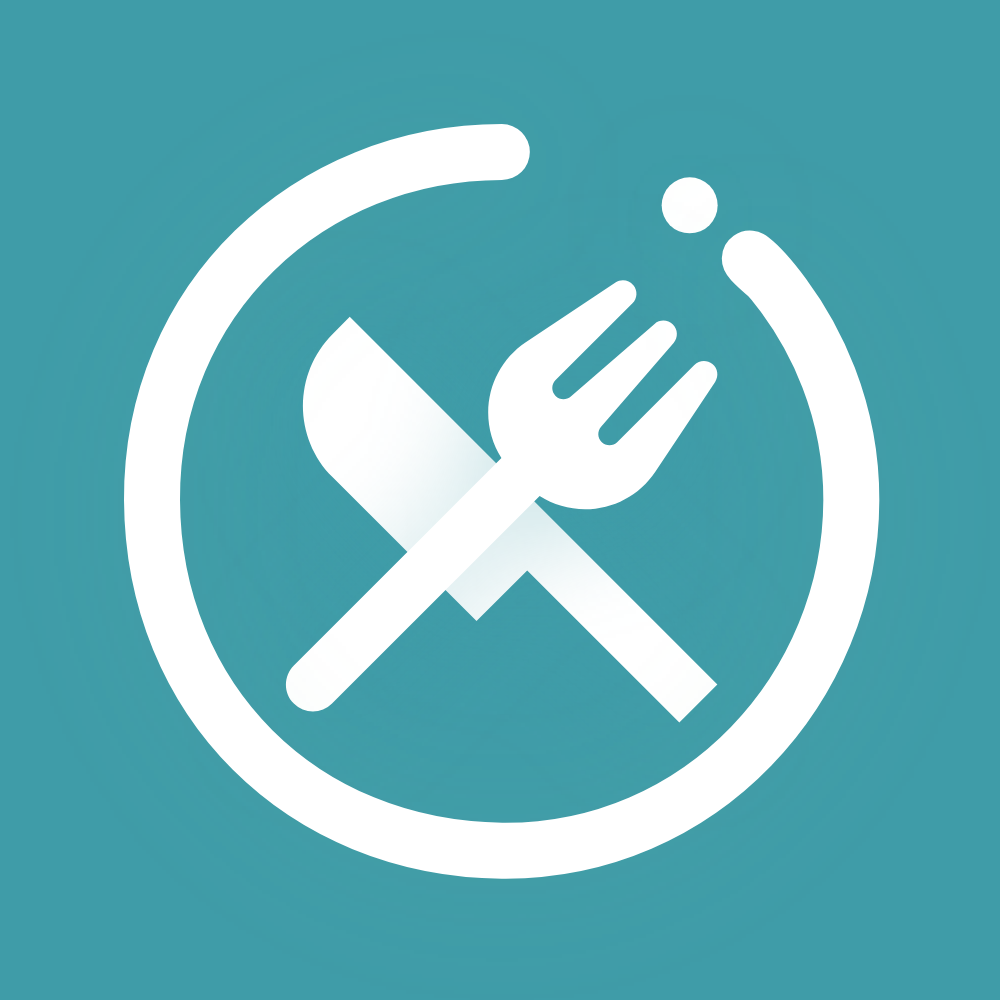
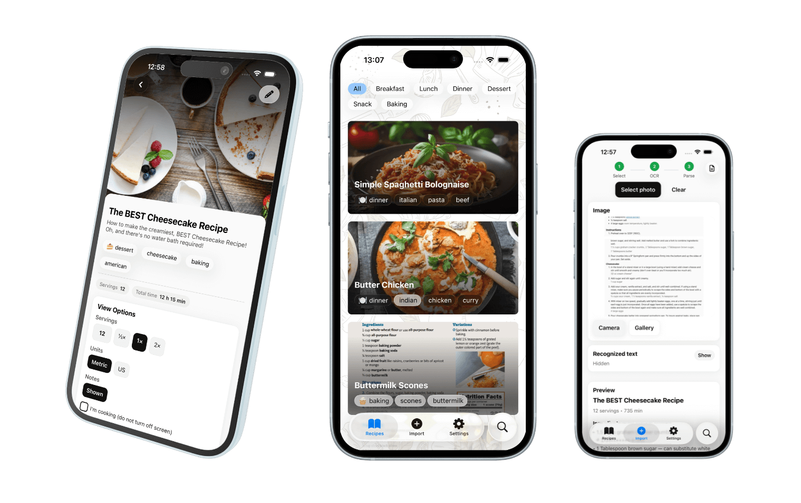
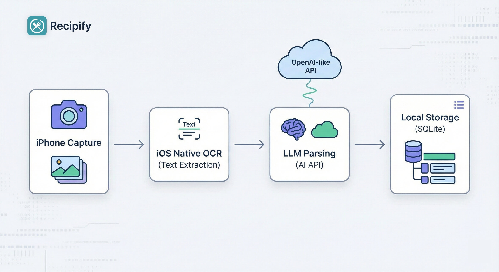

<a name="readme-top"></a>

[![Contributors][contributors-shield]][contributors-url]
[![Forks][forks-shield]][forks-url]
[![Stargazers][stars-shield]][stars-url]
[![Issues][issues-shield]][issues-url]
[![MIT License][license-shield]][license-url]
[![LinkedIn][linkedin-shield]][linkedin-url]

<br />
<div align="center">
<a href="[https://github.com/kovarjan/recipify](https://www.google.com/search?q=https://github.com/kovarjan/recipify)">

</a>

<h3 align="center">Recipify</h3>

<p align="center">
Scan. Parse. Cook.
<br />
A modern iOS recipe manager that turns messy photos into structured recipe data using AI.
<br />
<sub><strong>Bring your own API key:</strong> To use Recipify, you must supply your own OpenAI or OpenRouter API key.</sub>
<br />
<a href="[https://github.com/kovarjan/recipify](https://www.google.com/search?q=https://github.com/kovarjan/recipify)"><strong>Explore the docs »</strong></a>
<br />
<br />
<a href="[https://github.com/kovarjan/recipify/issues](https://www.google.com/search?q=https://github.com/kovarjan/recipify/issues)">Report Bug</a>
·
<a href="[https://github.com/kovarjan/recipify/issues](https://www.google.com/search?q=https://github.com/kovarjan/recipify/issues)">Request Feature</a>
</p>
</div>

<details>
<summary>Table of Contents</summary>
<ol>
<li><a href="#about-the-project">About The Project</a></li>
<li><a href="#key-features">Key Features</a></li>
<li><a href="#built-with">Built With</a></li>
<li><a href="#getting-started">Getting Started</a></li>
<li><a href="#usage">Usage</a></li>
<li><a href="#project-structure">Project Structure</a></li>
<li><a href="#contributing">Contributing</a></li>
<li><a href="#license">License</a></li>
</ol>
</details>

---

## About The Project

Recipify solves the "screenshot graveyard" problem. We all have dozens of recipe photos or screenshots that are impossible to search. Recipify uses **OCR (Optical Character Recognition)** and **Large Language Models (LLMs)** to intelligently parse ingredients, steps, and metadata from any image, storing them in a beautiful, searchable local database.

### Key Features

* 📷 **AI Scanning:** Take a photo of a cookbook or upload a screenshot.
* 🧠 **Smart Parsing:** LLM-powered extraction converts raw text into structured JSON (Ingredients, Servings, Time, Instructions).
* 🗂️ **Automatic Categorization:** Recipes are auto-tagged (e.g., Dessert, Vegan) for easy organization.
* 🌐 **Multi-language Support:** Recipify supports multiple languages for both OCR and recipe parsing.
* 📁 **Offline First:** All your recipes are stored locally via SQLite for instant access.
* 🔍 **Fast Search:** Find recipes by ingredient or title in milliseconds.
* 📱 **Cross-Platform:** Native performance on iOS and Android via Expo.

<p align="right">(<a href="#readme-top">back to top</a>)</p>

## Preview



---

### Built With

* [][ReactNative-url]
* [][Expo-url]
* [][TypeScript-url]
* [][SQLite-url]
* [][OpenAI-url]



<p align="right">(<a href="#readme-top">back to top</a>)</p>

---

## Getting Started

### Prerequisites

* npm
```sh
npm install npm@latest -g

```


* An API Key from [OpenRouter](https://openrouter.ai/) or [OpenAI](https://openai.com/).

### Installation

1. Clone the repo
```bash
git clone https://github.com/kovarjan/recipify.git

```


2. Install dependencies
```bash
npm install

```


3. Set up environment variables
```bash
cp sample.env .env

```


Enter your API key in `.env`:
```env
EXPO_PUBLIC_OPENROUTER_MODEL=your_model_here
EXPO_PUBLIC_OPENROUTER_API_KEY=your_key_here
EXPO_PUBLIC_OPENROUTER_API_URL=https://openrouter.ai/api/v1/chat/completions or your preferred endpoint

```


4. Start the application
```bash
   npx expo start
```

5. Or to run on iOS simulator directly [full rebuild]:
```bash
npx expo prebuild -p ios --clean
npx expo run:ios
cd ios
pod install
```

<p align="right">(<a href="#readme-top">back to top</a>)</p>

---

## Usage

### 1. Capture

Point your camera at a physical cookbook or a handwritten note.

### 2. AI Parsing

The app performs OCR and sends the text to the LLM. The AI identifies what is an ingredient and what is a step, even if the text is messy.

### 3. Save & Organize

The recipe is saved to your local SQLite database with an automatic category assignment.

> **Note:** For best results, ensure the recipe text is well-lit and clearly visible in the camera frame.

<p align="right">(<a href="#readme-top">back to top</a>)</p>

---

## Project Structure

```text
app/              # Expo Router: File-based navigation & screens
components/       # UI Atoms, Molecules, and Recipe Cards
contexts/         # Global state (Theme, Auth, Database Provider)
hooks/            # Custom hooks for OCR and LLM logic
services/         # API wrappers (OpenRouter) & Database Schema
assets/           # Local fonts and static images

```

<p align="right">(<a href="#readme-top">back to top</a>)</p>

## License

Distributed under the MIT License. See `LICENSE` for more information.

<p align="right">(<a href="#readme-top">back to top</a>)</p>

<!-- MARKDOWN LINKS & IMAGES -->
[contributors-shield]: https://img.shields.io/github/contributors/kovarjan/runpod-ollama-anything-llm.svg?style=for-the-badge
[contributors-url]: https://github.com/kovarjan/recipify/graphs/contributors
[forks-shield]: https://img.shields.io/github/forks/kovarjan/runpod-ollama-anything-llm.svg?style=for-the-badge
[forks-url]: https://github.com/kovarjan/recipify/network/members
[stars-shield]: https://img.shields.io/github/stars/kovarjan/runpod-ollama-anything-llm.svg?style=for-the-badge
[stars-url]: https://github.com/kovarjan/recipify/stargazers
[issues-shield]: https://img.shields.io/github/issues/kovarjan/runpod-ollama-anything-llm.svg?style=for-the-badge
[issues-url]: https://github.com/kovarjan/recipify/issues
[license-shield]: https://img.shields.io/github/license/kovarjan/runpod-ollama-anything-llm.svg?style=for-the-badge
[license-url]: https://github.com/kovarjan/recipify/blob/master/LICENSE.txt
[linkedin-shield]: https://img.shields.io/badge/-LinkedIn-black.svg?style=for-the-badge&logo=linkedin&colorB=555
[linkedin-url]: https://www.linkedin.com/in/jan-kov%C3%A1%C5%99-133b7217a/
[Docker.dev]: https://img.shields.io/badge/Docker-20232A?style=for-the-badge&logo=docker&logoColor=2496ED
[Docker-url]: https://www.docker.com/
[ReactNative-url]: https://reactnative.dev/
[Expo-url]: https://expo.dev/
[TypeScript-url]: https://www.typescriptlang.org/
[SQLite-url]: https://www.sqlite.org/index.html
[OpenAI-url]: https://openai.com/
